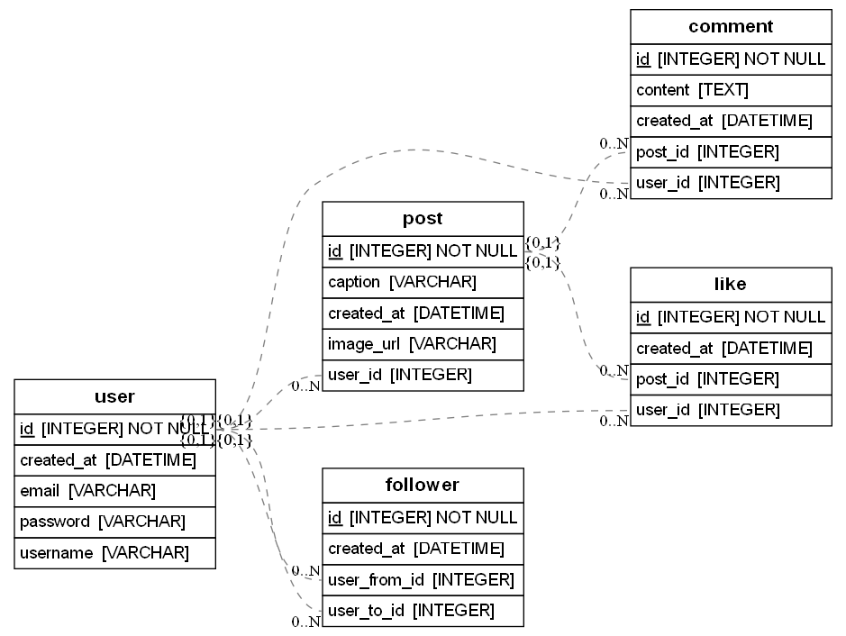

# Modelo de Datos - Instagram

Este proyecto representa el modelo relacional de datos para una aplicación tipo Instagram, diseñado con **SQLAlchemy** y visualizado automáticamente como diagrama UML con **ERAlchemy** y **Graphviz**.

---

## 🗂 Arquitectura visual (Diagrama UML)

Diagrama generado automáticamente desde el código:  


Visualización interactiva disponible aquí:  
 🔗 https://dbdiagram.io/d/Instagram_Model-6893c8c7dd90d17865ca3356

---

## 🧱 Estructura del modelo

| Entidad   | Relación principal                                        |
|-----------|-----------------------------------------------------------|
| **User**  | Tiene `Post`, `Comment`, `Like`, y relaciones con seguidores (`Follower`). |
| **Post**  | Relacionado con `User`; puede tener muchos `Comment` y `Like`. |
| **Comment** | Relacionado con `Post` y `User`.                        |
| **Like**  | Relaciona `User` con `Post`.                              |
| **Follower** | Una relación entre dos usuarios (siguiendo / seguido). |

---

## 🛠 Tecnologías utilizadas

- Python 3  
- SQLAlchemy  
- ERAlchemy  
- pipenv  
- Graphviz

---

## 🚀 ¿Cómo ejecutar localmente?

```bash
git clone https://github.com/alejandrabarcena/-modelo-instagram-bootcamp2025.git
cd -modelo-instagram-bootcamp2025
pipenv install
pipenv shell
pipenv run python render.py
